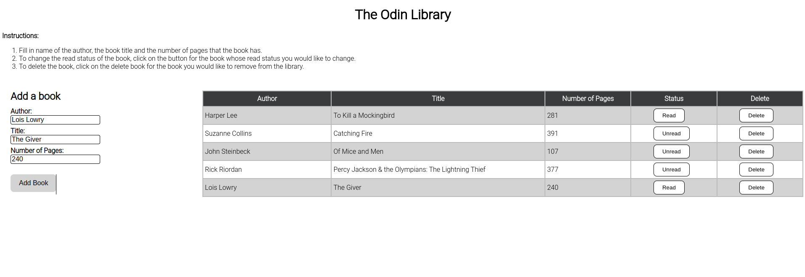

# odin-project-library

Submission for the library project on The Odin Project. The purpose of this is to focus on JavaScript concepts such as DOM manipulation and objects. By tying in HTML, CSS, and JavaScript, you can create a basic library app that can add books, delete books and track their read status.

**Note:** The app only works on desktop. It was not designed to be responsive and will look off on smaller devices.

